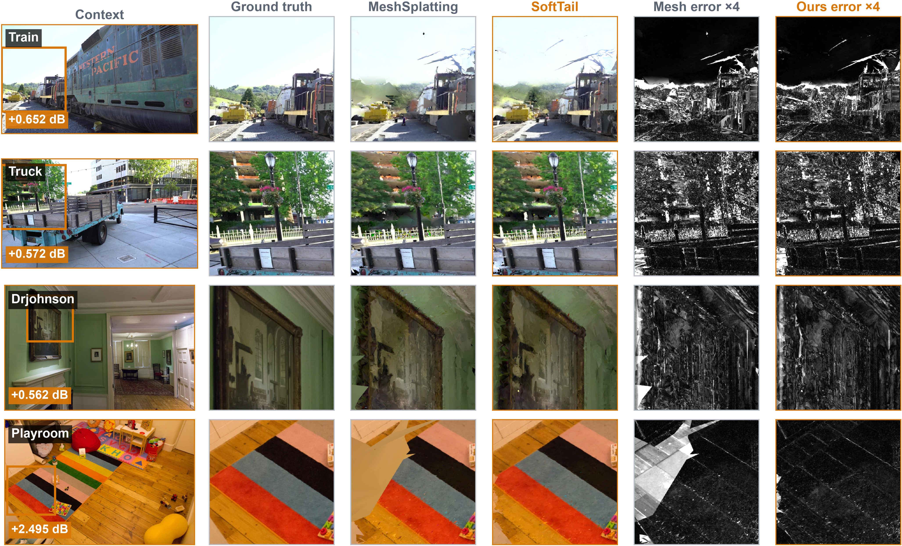
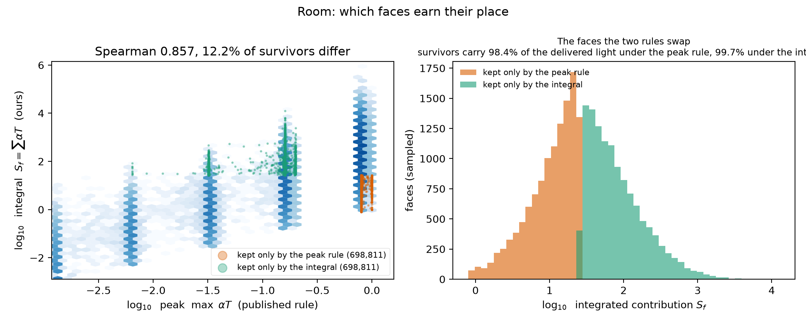

<h1 align="center">SoftTail</h1>

<p align="center">
  <strong>Opacity-relaxed connected mesh splatting with integrated-contribution triangle survival</strong>
</p>

<p align="center">
  <a href="#installation"></a>
  <a href="#installation"></a>
  <a href="#installation"></a>
  <a href="LICENSE.md"></a>
  <a href="#model-zoo-and-release-artifacts"></a>
</p>

<p align="center">
  <a href="#results">Results</a> ·
  <a href="#method-in-one-paragraph">Method</a> ·
  <a href="#ablation">Ablation</a> ·
  <a href="#installation">Install</a> ·
  <a href="#quick-start">Quick start</a> ·
  <a href="#reproduce-every-table-in-the-paper">Reproduce</a> ·
  <a href="#model-zoo-and-release-artifacts">Models</a> ·
  <a href="docs/REPRODUCIBILITY.md">Reproducibility</a>
</p>

<p align="center">
  
</p>

SoftTail renders a **single connected colored triangle mesh** — not a soup of
disconnected primitives — directly with a differentiable rasterizer, and it
beats its mesh-based baseline on all three standard novel-view-synthesis
benchmarks while shipping a smaller mesh.

Two changes, both about the same thing: *a connected mesh has a hard triangle
budget, so every triangle that survives has to earn its place.*

1. **Opacity-relaxed training.** The hardening schedule ends at `0.8` instead of
   pushing every triangle to opacity one, and the renderer absorbs the residual
   transmittance at ray termination so no radiance is lost.
2. **Integrated-contribution triangle survival (OATS).** Face importance is the
   integrated contribution `S_f = Σ_pixels α·T` — how much light a triangle
   actually delivers across the whole dataset — instead of the single brightest
   pixel it ever touched. The same statistic drives pruning and densification
   during training *and* the final cleanup, at an **unchanged face budget**.

One trained checkpoint gives two deployment points: **SoftTail-Quality** (`4×`
supersampling) and **SoftTail-Speed** (`3×`).

## Highlights

- **Three benchmarks, 13 scenes, 12/13 scenes improved.** Mean PSNR, SSIM and
  LPIPS all improve over the matched mesh baseline on Mip-NeRF 360,
  Tanks & Temples and Deep Blending.
- **The gain is not bought with extra triangles.** Re-cutting our mesh down to
  the baseline's exact face count keeps `+0.192` dB of the `+0.206` dB
  Mip-NeRF 360 gain (9/9 scenes) — only **6.6%** of the gain is capacity.
- **A one-line statistic, not a new architecture.** No teacher, no router, no
  extra network: one `atomicAdd` beside the rasterizer's existing `atomicMax`.
- **Everything is auditable.** Every number below is produced by a frozen
  evaluator, archived as JSON, and hashed in a SHA-256 manifest. The tables in
  the paper are *generated* by [`results/make_tables.py`](results/make_tables.py)
  from the JSONs in [`results/formal/`](results/formal), so they cannot drift.

## Results

All rows are trained and evaluated with the same code, splits, metric
implementation, iteration count and GPU (NVIDIA A40). **Baseline** is
MeshSplatting reproduced in this repository.

### Mip-NeRF 360 (9 scenes)

| Method | PSNR ↑ | SSIM ↑ | LPIPS ↓ | FPS ↑ |
|---|---:|---:|---:|---:|
| MeshSplatting (baseline) | 24.797 | 0.7317 | 0.3075 | 18.1 |
| **SoftTail-Quality** | **25.165** | **0.7478** | **0.2846** | 15.4 |
| SoftTail-Speed | 25.122 | 0.7461 | 0.2858 | 18.6 |

### Tanks & Temples (2 scenes)

| Method | PSNR ↑ | SSIM ↑ | LPIPS ↓ | FPS ↑ |
|---|---:|---:|---:|---:|
| MeshSplatting (baseline) | 20.664 | 0.7589 | 0.2760 | 16.0 |
| **SoftTail-Quality** | **21.063** | **0.7776** | **0.2487** | 27.4 |
| SoftTail-Speed | 21.050 | 0.7763 | 0.2505 | **32.8** |

### Deep Blending (2 scenes)

| Method | PSNR ↑ | SSIM ↑ | LPIPS ↓ | FPS ↑ |
|---|---:|---:|---:|---:|
| MeshSplatting (baseline) | 27.089 | 0.8419 | 0.3352 | 21.6 |
| **SoftTail-Quality** | **27.732** | **0.8537** | **0.3154** | 21.3 |
| SoftTail-Speed | 27.714 | 0.8528 | 0.3169 | 25.6 |

Per-scene values, runtime settings, checkpoint sizes and source revisions are in
[`sota/experiment.md`](sota/experiment.md); the machine-readable tables, with
per-view metrics for every scene and arm, are in
[`results/formal/`](results/formal).

### The gain is not extra capacity

Any change to a pruning rule also changes how many triangles survive, so a
quality gain and a bigger mesh are confounded. We therefore re-cut the *same*
trained model offline down to the baseline's exact face count and re-score it,
with no retraining:

| Mip-NeRF 360, 9 scenes | Mean ΔPSNR vs baseline | Scenes improved |
|---|---:|---:|
| SoftTail at its own face count | +0.206 dB | 9 / 9 |
| SoftTail re-cut to the baseline's face count | **+0.192 dB** | **9 / 9** |

`6.6%` of the gain comes from capacity; the rest comes from *which* triangles
survive. Reproduce with [`sota/batch43.sh`](sota/batch43.sh).

### What it costs

| Mip-NeRF 360, 9 scenes | + opacity floor (v1) | SoftTail |
|---|---:|---:|
| Training time, mean (one A40) | 1.95 h | 2.29 h |
| Render FPS, Quality arm | 18.0 | 15.4 |
| Render FPS, Speed arm | 21.8 | 18.6 |

Training pays about `17%` for the extra accumulator, and rendering is slower
because the runs keep `2.6–33%` more faces than v1 — the equal-budget row above
is the like-for-like comparison. Training times are read from the run logs and
were not measured on an idle machine, so treat them as indicative.

## Method in one paragraph

A connected mesh cannot simply grow primitives where the loss is high — its
triangle budget is fixed by the topology it must keep. The published rule ranks
a face by `max_blending`, the largest `α·T` it ever produced **at one pixel**.
That statistic rewards a triangle that flashes once in one view and punishes a
triangle that is quietly visible everywhere, which is exactly backwards for a
representation whose faces are shared. SoftTail ranks a face by the integral of
the same quantity, `S_f = Σ α·T`, accumulated by one `atomicAdd` next to the
rasterizer's existing `atomicMax`. The integral decides **which** faces are
deleted; the published rule still decides **how many**
([`sota/survival.py`](sota/survival.py)), so mesh sizes stay comparable by
construction. It is applied in the `4k–11k` pruning/densification passes
(`--integrated_importance`) and once more in the final cleanup
([`sota/survival_cleanup.py`](sota/survival_cleanup.py)).

<p align="center">
  
</p>

Measured on Room's 11.4M faces ([`sota/survival_statistic.py`](sota/survival_statistic.py)):
the two rules agree on most faces (Spearman `0.857`) but **swap 12.2% of the
survivors**. The faces the published rule keeps and ours drops are bright once —
mean peak `0.80` — yet carry a mean integrated contribution of only `12.9`. The
faces ours keeps instead never look bright — mean peak `0.15` — and carry `139`,
more than ten times as much light delivered. Ranking by the peak discards `1.6%`
of everything the mesh renders; ranking by the integral discards `0.3%`.

## Ablation

The integral is applied twice — during training and in the final cleanup — so
the two halves are separated on all nine Mip-NeRF 360 scenes. Every row keeps
the published face budget, so the rows differ only in *which* faces survive:

| Training statistic | Cleanup statistic | PSNR ↑ | SSIM ↑ | LPIPS ↓ | ΔPSNR |
|---|---|---:|---:|---:|---:|
| peak (published) | peak (published) | 24.960 | 0.7392 | 0.3006 | — |
| **integral** | peak | 25.117 | 0.7457 | 0.2875 | +0.158 (9/9) |
| **integral** | **integral** | **25.165** | **0.7478** | **0.2846** | **+0.206 (9/9)** |

Training-time survival carries roughly three quarters of the gain, and the
cleanup adds the rest; neither half is free. Holding the training statistic at
the published rule and changing only the cleanup (bicycle, garden, room) gives
`+0.037` dB — and **re-picking the same number of faces at random collapses the
mesh by `-1.82` dB**, which is the control that says the gain comes from the
ranking, not from disturbing the cleanup.

Reproduce with [`sota/batch45.sh`](sota/batch45.sh) (evaluation only); the raw
numbers are in
[`results/formal/softtail_nine_scene_ablation.json`](results/formal/softtail_nine_scene_ablation.json).

## Installation

The formal experiments use Python 3.11, PyTorch 2.7.1 and CUDA 12.6.

```bash
git clone --recursive https://github.com/ChizkiyahuOhayon/mesh-splatting-texel.git
cd mesh-splatting-texel

micromamba create -n mesh_splatting python=3.11
micromamba activate mesh_splatting
micromamba install nvidia/label/cuda-12.6.0::cuda

pip install torch==2.7.1 torchvision==0.22.1
pip install -r requirements.txt
bash compile.sh
pip install ./submodules/simple-knn --no-build-isolation
pip install ./submodules/effrdel --no-build-isolation
```

Every formal script sources
[`sota/ensure_environment.sh`](sota/ensure_environment.sh), which checks that
PyTorch and NVCC agree on the CUDA version and rebuilds the native rasterizer
whenever its source revision changes — a stale kernel can silently invalidate a
whole table, so this is not optional.

Sanity check (no GPU needed for the rule tests):

```bash
python -m unittest tests.test_integrated_importance -v
```

## Datasets

Download the datasets from their authors; we do not redistribute their images.

| Dataset | Official source | Evaluated scenes | Expected layout |
|---|---|---|---|
| Mip-NeRF 360 | [project page](https://jonbarron.info/mipnerf360/) | bicycle, flowers, garden, stump, treehill, room, counter, kitchen, bonsai | `images[_2/_4]`, `sparse/0` |
| Tanks & Temples | [official downloader](https://www.tanksandtemples.org/download/) · [licence](https://www.tanksandtemples.org/license/) | train, truck | `images`, `sparse/0` |
| Deep Blending | [author release](https://github.com/Phog/DeepBlending#usage) | drjohnson, playroom | `images`, `sparse/0` |

Resolution, indoor overrides and the primitive caps are applied automatically
per scene by [`sota/run.sh`](sota/run.sh) — outdoor Mip-NeRF 360 scenes use
`images_4`, indoor ones `images_2` with `--indoor`, `train`/`truck` cap
primitives at `2.5M`/`2.0M`. The full protocol is in
[`docs/REPRODUCIBILITY.md`](docs/REPRODUCIBILITY.md).

## Quick start

### 1. Train one scene

```bash
export DATA_ROOT=/path/to/mipnerf360
export RUNS=/path/to/runs
export CUDA_VISIBLE_DEVICES=0

bash sota/run.sh softtail garden \
  --final_opacity 0.8 --integrated_importance --save_precleanup
```

`--final_opacity 0.8` relaxes the hardening schedule, `--integrated_importance`
switches training-time survival to the integral, and `--save_precleanup` keeps
the pre-cleanup state so the final cleanup can be re-run offline at any budget.

### 2. Cleanup by integrated survival

```bash
python -m sota.survival_cleanup \
  -s "$DATA_ROOT/garden" -m "$RUNS/softtail__garden" \
  -i images_4 --eval --out "$RUNS/cut__garden"
```

This writes both arms side by side — `v1/` (published peak rule) and `oats/`
(integral) — at the **same face count**, plus `survival.json` recording how much
the two rules disagree. Add `--budget N` to cut to an explicit face count, which
is how the equal-budget control above is produced.

### 3. Evaluate the two operating points

```bash
python -m sota.main_table_eval \
  -s "$DATA_ROOT/garden" -m "$RUNS/cut__garden/oats" \
  -i images_4 --eval --iteration 30000 \
  --scene garden --arm ours_quality \
  --output /path/to/eval/garden/quality
```

The evaluator, not the checkpoint, fixes the deployment settings per arm:

| Arm | Opacity floor | Supersampling | Tail cutoff | Absorb tail |
|---|---:|---:|---:|:---:|
| `stock` | 0.9999 | 4× | 0.0001 | no |
| `ours_quality` | 0.8 | 4× | 0.01 | yes |
| `ours_speed` | 0.8 | 3× | 0.01 | yes |

It writes `result.json` (per-view and mean metrics, triangle and vertex counts,
checkpoint bytes, source revision, GPU) and a `DONE` marker, and refuses to
overwrite an existing output directory.

## Reproduce every table in the paper

Each launcher is resumable: re-running it picks up wherever it stopped, and
skips scenes that already carry `DONE`.

| Table | Launcher | What it does |
|---|---|---|
| Mip-NeRF 360 main table (9 scenes) | [`sota/batch42.sh`](sota/batch42.sh) | trains, cuts and scores both arms |
| Equal-budget control (9 scenes) | [`sota/batch43.sh`](sota/batch43.sh) | re-cuts to the baseline's face count, evaluation only |
| Tanks & Temples + Deep Blending | [`sota/batch44.sh`](sota/batch44.sh) | trains, cuts and scores 4 scenes |
| Component ablation (9 scenes) | [`sota/batch45.sh`](sota/batch45.sh) | scores the training-only corner, evaluation only |
| Paper tables (LaTeX) | [`results/make_tables.py`](results/make_tables.py) | regenerates `results/tables.tex` from the archived JSONs |

```bash
GPU=0 \
DATA_ROOT=/path/to/mipnerf360 \
NAS_ROOT=/path/to/workspace \
bash sota/batch42.sh
```

The aggregators refuse missing or mismatched scene/arm identities and write a
JSON table only once every required result is present.

## Model zoo and release artifacts

**SoftTail release bundle:** [Google Drive](https://drive.google.com/drive/folders/1Gj7ykZadiJ2IuTUrN046vAEGZMSnA_PY)

| Contents | Notes |
|---|---|
| SoftTail checkpoints, 13 scenes | `point_cloud_state_dict.pt`, loadable by `sota/main_table_eval.py` |
| Formal result JSONs and aggregate tables | per-view metrics for every scene and arm |
| Equal-budget and ablation evidence | the JSONs the paper tables are generated from |
| `SHA256SUMS` | verify every archive before use |

Baseline weights are not duplicated: the launchers above reproduce them from the
same pipeline. Raw third-party datasets are intentionally not redistributed.

## Reproducibility and data availability

Code, launchers and the exact protocol are versioned here; generated
checkpoints, machine-readable results and figure evidence are in the release
bundle. Mip-NeRF 360, Tanks & Temples and Deep Blending remain available from
their official sources under their own terms. See
[`docs/REPRODUCIBILITY.md`](docs/REPRODUCIBILITY.md) for artifact mapping,
provenance and the data-availability statement.

## Citation

```bibtex
@misc{softtail,
  title  = {SoftTail: Opacity-Relaxed Connected Mesh Splatting with
            Integrated-Contribution Triangle Survival},
  author = {Liu, Zhao},
  year   = {2026},
  note   = {Code: https://github.com/ChizkiyahuOhayon/mesh-splatting-texel}
}
```

## Acknowledgements and licence

SoftTail is built on the official
[MeshSplatting](https://github.com/meshsplatting/mesh-splatting) implementation,
which in turn builds on 3D Gaussian Splatting. We thank their authors for
releasing the connected colored-mesh representation, the training pipeline and
the differentiable triangle rasterizer. Please cite MeshSplatting when using
this repository, and consult [`LICENSE.md`](LICENSE.md) and
[`LICENSE_GS.md`](LICENSE_GS.md) for the applicable terms.
